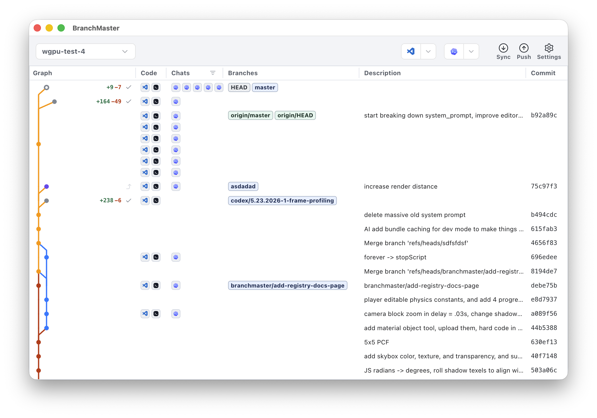

# Welcome to BranchTracker!

<table>
  <tr>
    <td>
      
    </td>
    <td>
      
    </td>
    <td>
      
    </td>
    <td>
      
    </td>
  </tr>
</table>

It's easy to spin up 100 agents in Codex, but keeping track of them all is hard. BranchTracker was built to fix that.

[BranchTracker](https://branchtracker.com) is a desktop app that lets you view your parallel agents in the context of Git. It also lets you branch, commit, merge, and push, without fumbling with Codex or Cursor.

## Contributing

Feel free to submit an [Issue](https://github.com/glassdevtools/branchtracker/issues) for suggestions.

## Download

Download BranchTracker on our website: https://branchtracker.com.

	
	

